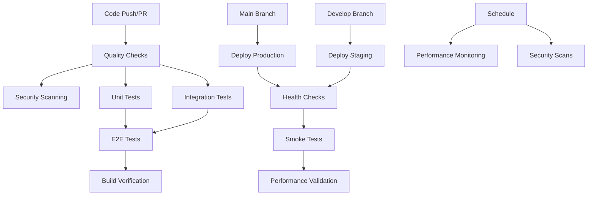

# GitHub Actions CI/CD Workflows

This directory contains comprehensive CI/CD workflows for the BuildMyStack project. The workflows provide automated testing, security scanning, performance monitoring, and deployment capabilities.

## 🚀 Available Workflows

### 1. CI Pipeline (`ci.yml`)
**Trigger**: Push to `main`, `develop`, `project-setup-infrastructure` branches, and pull requests

**Jobs**:
- **Quality Checks**: Linting, formatting, type checking
- **Unit Tests**: Fast, isolated component tests with coverage
- **Integration Tests**: API and database integration tests
- **E2E Tests**: End-to-end testing with Playwright
- **Build Verification**: Production build validation
- **CI Status Check**: Overall pipeline status summary

**Features**:
- Parallel execution for maximum speed
- PostgreSQL and Redis services
- Test coverage reporting with Codecov
- Artifact uploads for test reports
- Comprehensive status checking

### 2. Security Scanning (`security.yml`)
**Trigger**: Push, pull requests, daily at 2 AM UTC, manual dispatch

**Jobs**:
- **Dependency Audit**: NPM vulnerability scanning
- **CodeQL Analysis**: GitHub's semantic code analysis
- **Security Test Suite**: Custom security tests
- **Trivy Container Scan**: Docker image vulnerability scanning
- **Snyk Scanning**: Third-party security analysis (optional)
- **Security Headers Check**: Configuration validation

**Features**:
- SARIF report uploads to GitHub Security tab
- Comprehensive security artifact collection
- Daily automated scans
- Integration with multiple security tools

### 3. Deployment (`deploy.yml`)
**Trigger**: Push to `main`/`develop`, manual dispatch

**Jobs**:
- **Deploy Staging**: Automatic deployment from `develop` branch
- **Deploy Production**: Automatic deployment from `main` branch
- **Rollback Production**: Automatic rollback on failure
- **Deployment Summary**: Status reporting

**Features**:
- Environment-specific configurations
- Health checks and smoke tests
- Performance validation
- GitHub releases for production deployments
- Automatic rollback capabilities
- Manual deployment triggers

### 4. Performance Monitoring (`performance.yml`)
**Trigger**: Push, pull requests, daily at 6 AM UTC, manual dispatch

**Jobs**:
- **Lighthouse CI**: Performance auditing with Core Web Vitals
- **Bundle Analysis**: Build size analysis and optimization
- **Load Testing**: Stress testing with k6 (scheduled only)
- **Performance Summary**: Consolidated reporting

**Features**:
- PR performance comments
- Performance regression detection
- Bundle size tracking
- Load testing for production readiness
- Comprehensive performance metrics

## 🔧 Configuration Files

### Environment Setup (`ENV_SETUP.md`)
Complete guide for configuring:
- GitHub repository secrets
- Vercel environment variables
- Database configurations
- Security tool setup
- Monitoring and alerting

### Dependabot (`dependabot.yml`)
Automated dependency management:
- Weekly dependency updates
- Grouped updates by ecosystem
- Security-focused prioritization
- Automated PR creation and labeling

## 🛠️ Required Setup

### 1. GitHub Repository Secrets

**Essential Secrets**:
```bash
VERCEL_TOKEN          # Vercel deployment token
DATABASE_URL          # Production database connection
```

**Optional Secrets**:
```bash
SNYK_TOKEN           # Snyk security scanning
LHCI_GITHUB_APP_TOKEN # Lighthouse CI GitHub integration
LHCI_TOKEN           # Lighthouse CI server
SLACK_WEBHOOK_URL    # Deployment notifications
```

### 2. Vercel Configuration
- Configure project environments (production, preview)
- Set up environment-specific variables
- Link GitHub repository for automatic deployments

### 3. Database Setup
- Production PostgreSQL instance
- Staging database (separate from production)
- Connection pooling and SSL configuration

## 📊 Workflow Execution Flow



## 🎯 Quality Gates

### Pull Request Requirements
- ✅ All quality checks pass (linting, formatting, types)
- ✅ Unit test coverage maintained
- ✅ Integration tests pass
- ✅ E2E tests pass
- ✅ Security scans complete
- ✅ Build verification successful

### Production Deployment Requirements
- ✅ All CI checks pass
- ✅ Security scans pass
- ✅ Performance benchmarks met
- ✅ Database migrations ready
- ✅ Health checks pass

## 📈 Monitoring and Reports

### Test Coverage
- Unit test coverage reports via Codecov
- Integration test coverage tracking
- Coverage trend analysis

### Security Reports
- Vulnerability scan results in GitHub Security tab
- Dependency audit reports
- Security test results

### Performance Metrics
- Lighthouse CI scores and trends
- Bundle size analysis
- Load testing results
- Core Web Vitals tracking

## 🚨 Troubleshooting

### Common Issues

**❌ Deployment Failures**
- Check Vercel token permissions
- Verify environment variables
- Review build logs

**❌ Test Failures**
- Check database connectivity
- Verify test environment setup
- Review test isolation

**❌ Security Scan Issues**
- Update vulnerable dependencies
- Check security tool tokens
- Review security configurations

### Getting Help

1. **Check Workflow Logs**: GitHub Actions → Failed workflow → Job logs
2. **Review Documentation**: `ENV_SETUP.md` for configuration help
3. **Test Locally**: Run `npm run test:ci` to reproduce issues
4. **Security Issues**: Run `npm audit` and `npm run test:security`

## 🔄 Maintenance

### Regular Tasks
- [ ] Review dependency updates (weekly)
- [ ] Monitor security scan results (daily)
- [ ] Check performance trends (weekly)
- [ ] Update workflow versions (monthly)
- [ ] Review and rotate secrets (quarterly)

### Workflow Updates
- Keep GitHub Actions up to date
- Monitor for new security tools and integrations
- Optimize workflow performance and execution time
- Update quality thresholds based on project needs

## 📚 Additional Resources

- [GitHub Actions Documentation](https://docs.github.com/en/actions)
- [Vercel Deployment Guide](https://vercel.com/docs/deployments/git)
- [Lighthouse CI Documentation](https://github.com/GoogleChrome/lighthouse-ci)
- [CodeQL Documentation](https://codeql.github.com/docs/)
- [Dependabot Configuration](https://docs.github.com/en/code-security/dependabot)