# Architecture - Build My Stack

**Version:** 1.0.0
**Last Updated:** 2025-11-10

---

## Table of Contents

1. [Overview](#overview)
2. [System Architecture](#system-architecture)
3. [Technology Stack](#technology-stack)
4. [Component Architecture](#component-architecture)
5. [Data Flow](#data-flow)
6. [Security Architecture](#security-architecture)
7. [Infrastructure](#infrastructure)
8. [Deployment Architecture](#deployment-architecture)

---

## Overview

Build My Stack is a full-stack web application built with Next.js 14, featuring a modern architecture with type-safe APIs, real-time updates, and enterprise-grade security.

**Design Principles:**
- **Type Safety First:** End-to-end TypeScript with tRPC
- **Performance:** Sub-2s load times, Redis caching, optimized database queries
- **Security:** CSRF protection, rate limiting, input validation
- **Scalability:** Horizontal scaling ready, stateless design
- **Developer Experience:** Hot reload, comprehensive testing, clear documentation

---

## System Architecture

### High-Level Architecture

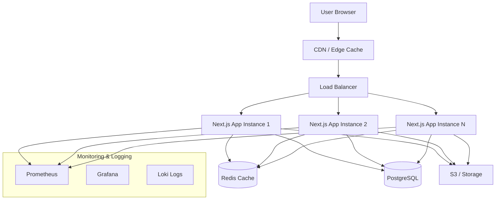

### Request Flow

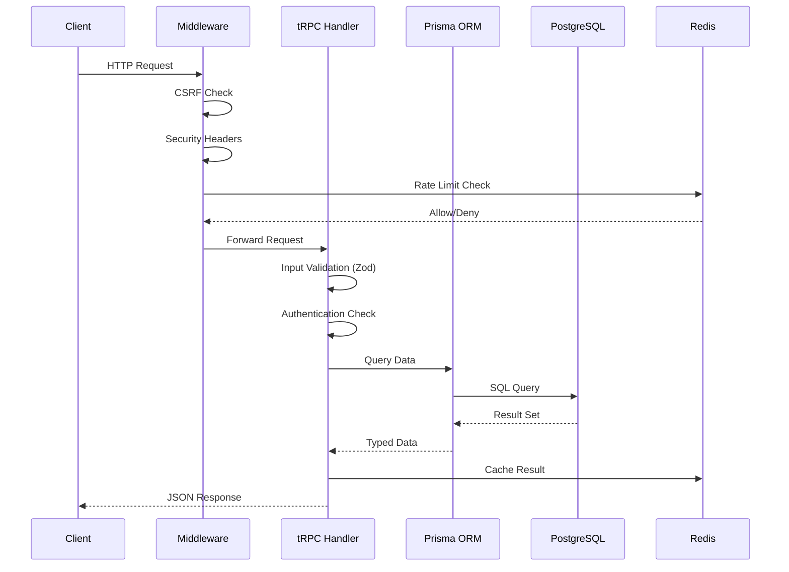

---

## Technology Stack

### Frontend

| Technology | Version | Purpose |
|------------|---------|---------|
| **Next.js** | 14.0.0 | React framework with App Router |
| **React** | 18.2.0 | UI library |
| **TypeScript** | 5.9.2 | Type safety |
| **Tailwind CSS** | 4.1.16 | Styling |
| **React Query** | 5.87.4 | Data fetching & caching |
| **Zustand** | 5.0.8 | Client state management |
| **Framer Motion** | 12.23.24 | Animations |
| **Radix UI** | Various | Accessible components |
| **Socket.IO Client** | 4.8.1 | Real-time updates |

### Backend

| Technology | Version | Purpose |
|------------|---------|---------|
| **tRPC** | 11.5.1 | Type-safe API layer |
| **Prisma** | 5.22.0 | ORM & database client |
| **PostgreSQL** | 16 | Primary database |
| **Redis** | 7 | Caching & rate limiting |
| **Zod** | 4.1.8 | Schema validation |
| **NextAuth.js** | 4.24.11 | Authentication |
| **Socket.IO** | 4.8.1 | WebSocket server |

### DevOps & Infrastructure

| Technology | Version | Purpose |
|------------|---------|---------|
| **Docker** | 24+ | Containerization |
| **Docker Compose** | 2.x | Local development |
| **Prometheus** | Latest | Metrics collection |
| **Grafana** | Latest | Metrics visualization |
| **OWASP ZAP** | Latest | Security scanning |
| **Artillery** | 2.0.26 | Load testing |

---

## Component Architecture

### Application Layers

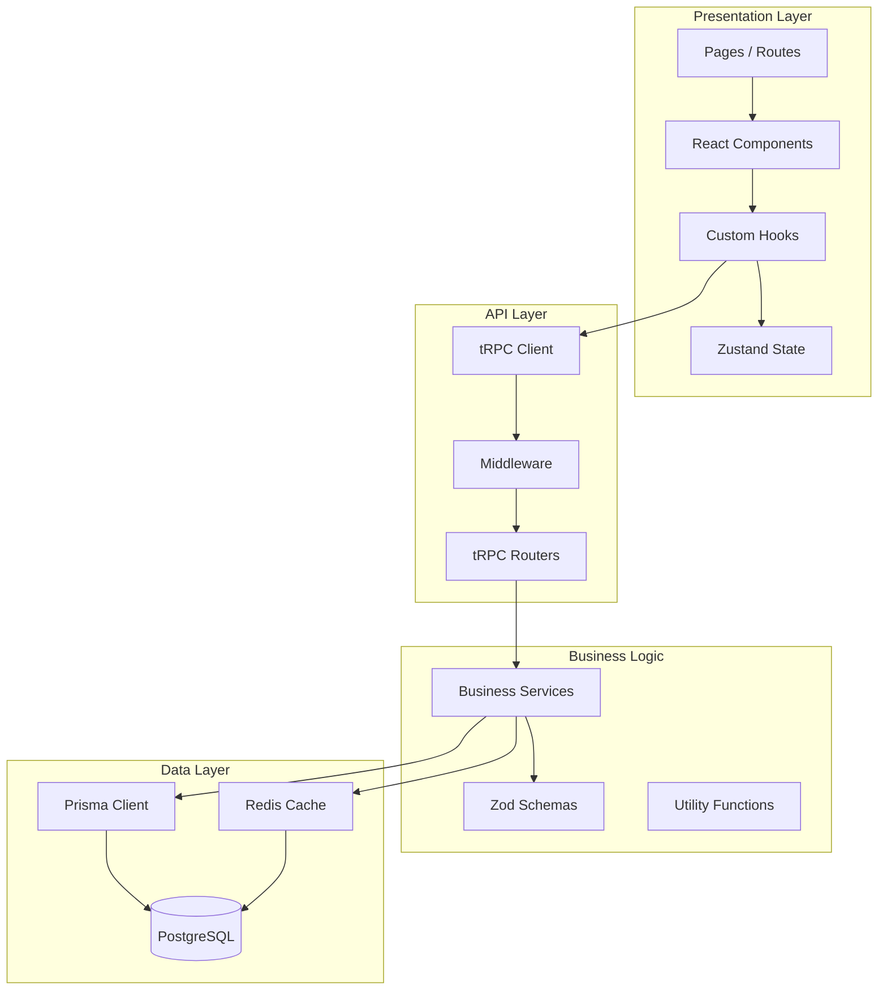

### Directory Structure

```
build-my-stack/
├── src/
│   ├── app/                    # Next.js App Router
│   │   ├── (routes)/           # Route groups
│   │   ├── api/                # REST API routes
│   │   └── layout.tsx          # Root layout
│   ├── components/             # React components
│   │   ├── ui/                 # Reusable UI components
│   │   ├── enterprise/         # Enterprise features
│   │   └── [feature]/          # Feature-specific
│   ├── hooks/                  # Custom React hooks
│   ├── lib/                    # Shared utilities
│   │   ├── security/           # Security utilities
│   │   ├── monitoring/         # Performance monitoring
│   │   └── database/           # Database utilities
│   ├── server/                 # Backend code
│   │   ├── routers/            # tRPC routers
│   │   ├── services/           # Business logic
│   │   └── trpc.ts             # tRPC setup
│   ├── stores/                 # Zustand stores
│   └── types/                  # TypeScript types
├── prisma/                     # Database schema
│   ├── schema.prisma           # Prisma schema
│   └── migrations/             # DB migrations
├── security/                   # Security testing
│   ├── zap-automation.yaml     # OWASP ZAP config
│   └── run-zap-*.sh            # Security scripts
├── docs/                       # Documentation
├── tests/                      # Tests
└── docker-compose.yml          # Local development
```

---

## Data Flow

### Stack Creation Flow

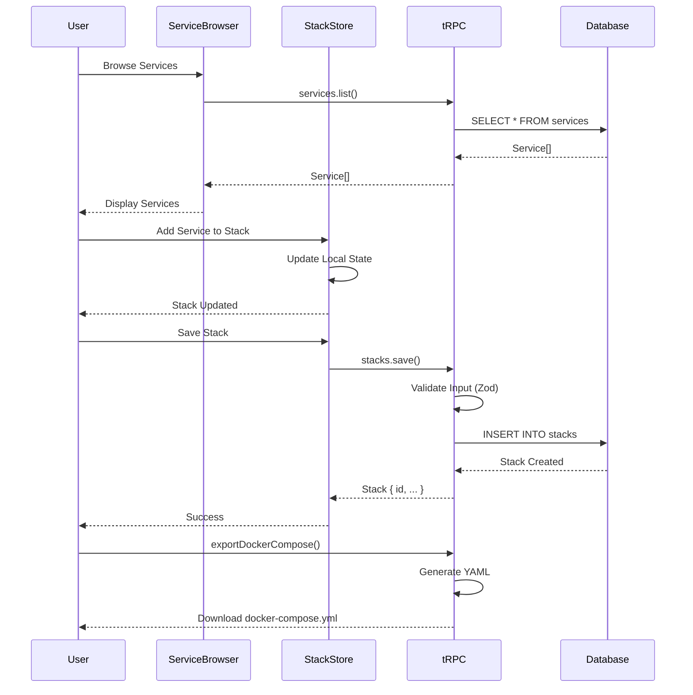

### Authentication Flow

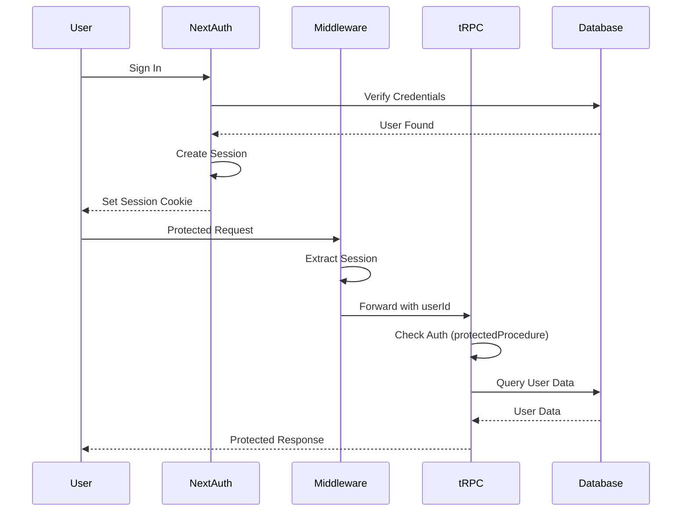

---

## Security Architecture

### Security Layers

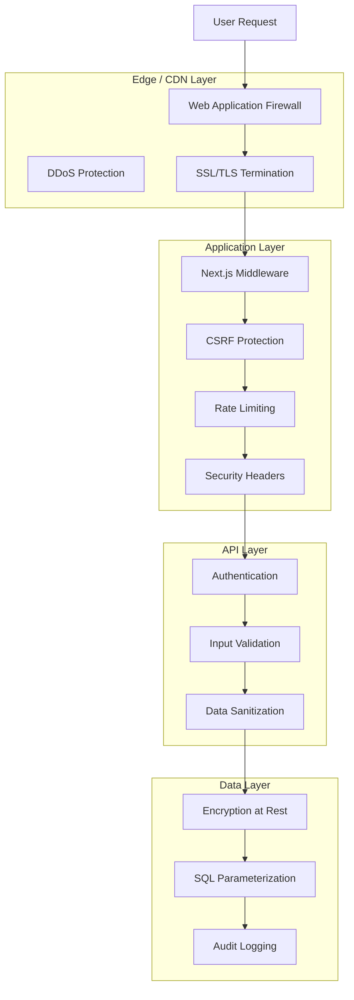

### Security Controls

| Layer | Control | Implementation |
|-------|---------|----------------|
| **Network** | DDoS Protection | Cloudflare / AWS Shield |
| **Edge** | WAF Rules | Rate limiting, IP filtering |
| **Transport** | HTTPS Only | HSTS, forced SSL redirect |
| **Middleware** | CSRF Protection | Origin/Referer validation |
| **Middleware** | Rate Limiting | Redis-based sliding window |
| **Middleware** | Security Headers | CSP, X-Frame-Options, etc. |
| **API** | Authentication | NextAuth.js sessions |
| **API** | Input Validation | Zod schemas |
| **API** | Output Sanitization | HTML entity encoding |
| **Database** | SQL Injection Prevention | Prisma parameterized queries |
| **Database** | Encryption | AES-256 at rest |
| **Database** | Access Control | Principle of least privilege |

---

## Infrastructure

### Development Environment

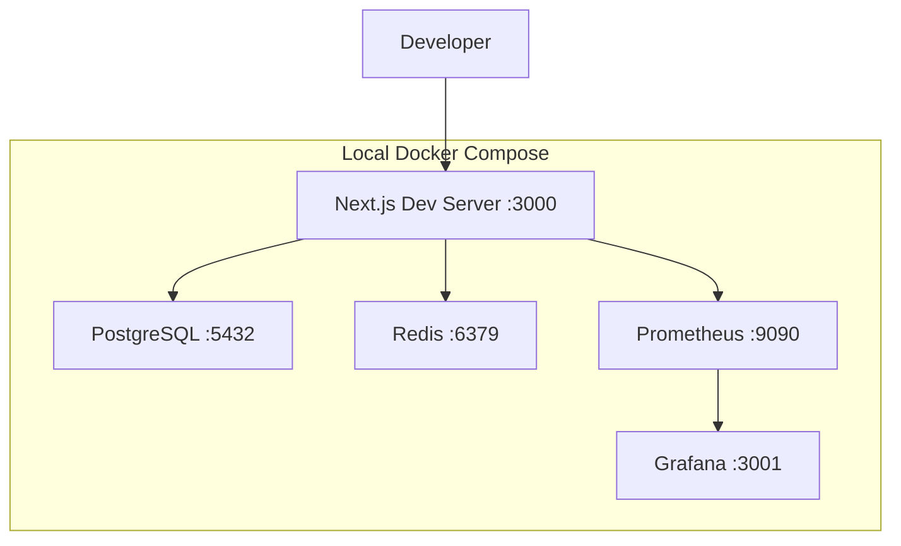

**docker-compose.yml Services:**
- **app:** Next.js development server with hot reload
- **postgres:** PostgreSQL 16 with persistent volume
- **redis:** Redis 7 for caching and rate limiting
- **prometheus:** Metrics collection
- **grafana:** Metrics visualization

### Production Infrastructure (AWS Example)

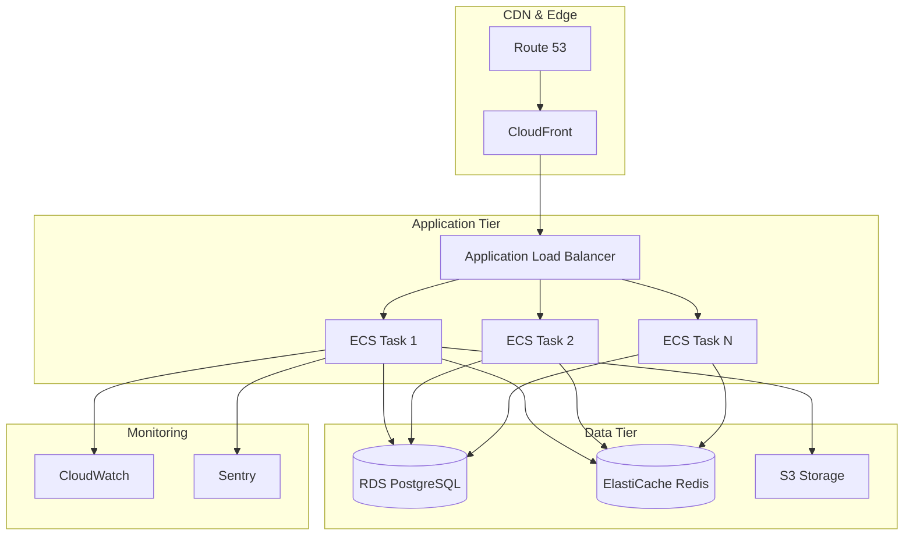

**Infrastructure Components:**
- **Route 53:** DNS management
- **CloudFront:** CDN for static assets
- **ALB:** Application load balancing with health checks
- **ECS Fargate:** Containerized application instances
- **RDS PostgreSQL:** Managed database with Multi-AZ
- **ElastiCache Redis:** Managed Redis cluster
- **S3:** Static file storage
- **CloudWatch:** Metrics, logs, and alarms
- **Sentry:** Error tracking and monitoring

---

## Deployment Architecture

### CI/CD Pipeline

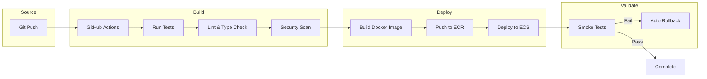

### Deployment Strategies

**Blue-Green Deployment:**
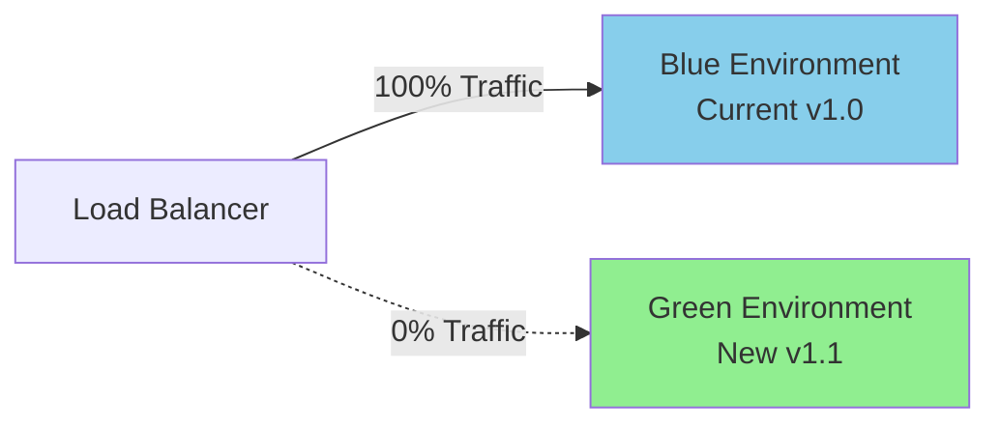

**Rolling Update:**
1. Deploy new version to 1 instance
2. Health check passes
3. Gradually shift traffic (20% → 50% → 100%)
4. Remove old instances

---

## Database Architecture

### Schema Overview

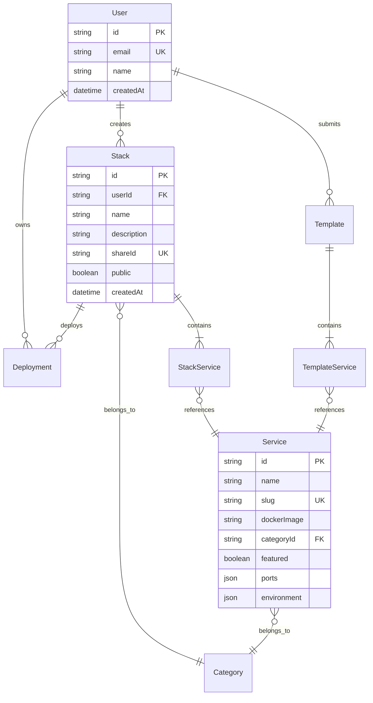

### Database Optimization

**Indexes:**
- `Service.slug` - Unique index for lookups
- `Service(categoryId, status)` - Composite index for filtering
- `Service(featured, status)` - Featured service queries
- `Service(status, createdAt)` - Sorting and pagination
- `Category.slug` - Unique index
- `Stack(userId, createdAt)` - User's stacks
- `Stack.shareId` - Public sharing

**Connection Pooling:**
- **Development:** 20 connections per instance
- **Production:** 100 connections (PgBouncer recommended)

---

## Performance Architecture

### Caching Strategy

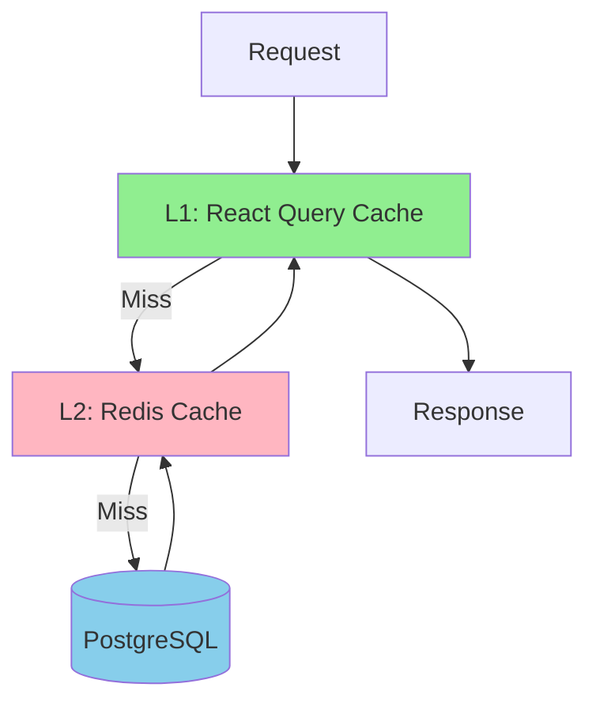

**Cache Layers:**
1. **Client-Side (React Query):** 5-10 minute TTL for frequently accessed data
2. **Server-Side (Redis):** 1-24 hour TTL for expensive queries
3. **Database:** Query result caching, prepared statements

**Cache Invalidation:**
- Write-through: Update cache on write
- TTL-based: Automatic expiration
- Event-driven: WebSocket notifications trigger cache refresh

---

## Scalability

### Horizontal Scaling

**Stateless Design:**
- Session data in Redis (shared across instances)
- File uploads to S3 (not local filesystem)
- No in-memory caching (use Redis)
- WebSocket server scaled separately

**Auto-Scaling Triggers:**
- CPU > 70% for 5 minutes → Scale up
- Request latency p95 > 1000ms → Scale up
- CPU < 30% for 10 minutes → Scale down
- Minimum 2 instances, maximum 20 instances

### Database Scaling

**Read Replicas:**
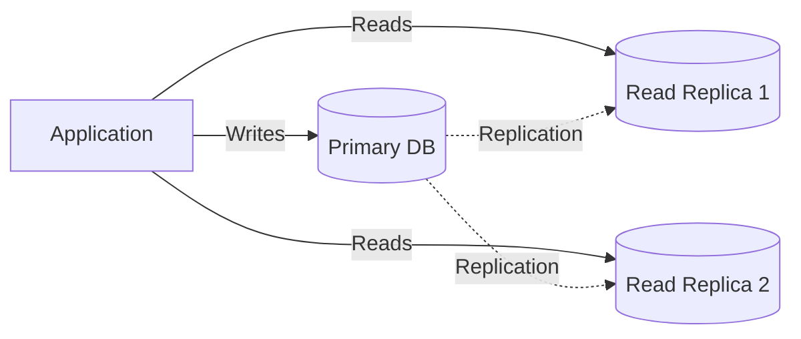

**Sharding Strategy (Future):**
- Shard by `userId` for user data
- Shard by `categoryId` for services
- Cross-shard queries via aggregation service

---

## Monitoring & Observability

### Metrics Collection

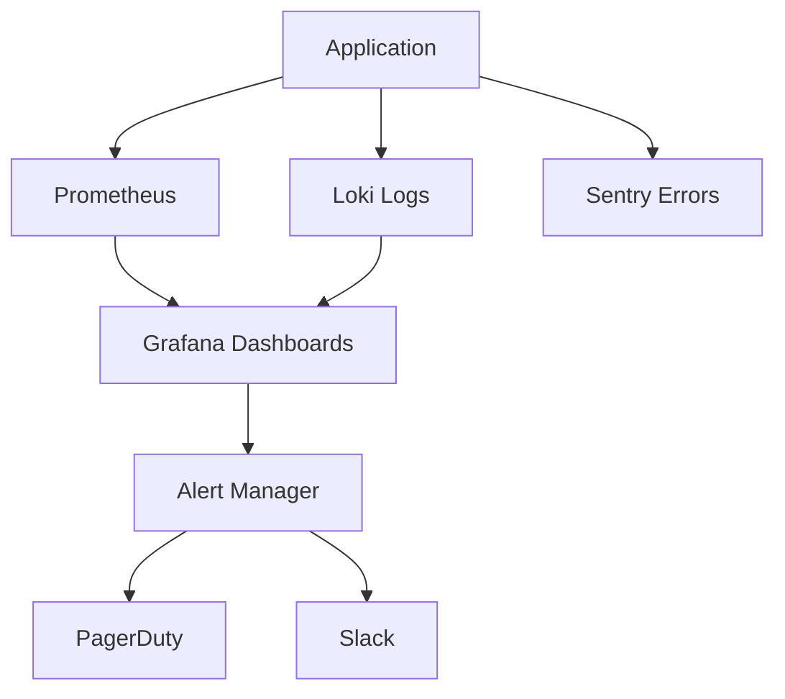

**Key Metrics:**
- **Application:** Request rate, response time, error rate
- **Business:** Stacks created, services added, users active
- **Infrastructure:** CPU, memory, disk, network
- **Database:** Query time, connection pool, deadlocks

**Logging Strategy:**
- **Structured JSON logs** for machine parsing
- **Log levels:** ERROR, WARN, INFO, DEBUG
- **Correlation IDs:** Track requests across services
- **Retention:** 30 days hot, 1 year cold storage

---

## Disaster Recovery

### Backup Strategy

**Database Backups:**
- **Automated:** Daily full backups, 30-day retention
- **Point-in-Time Recovery:** 7-day window
- **Cross-Region Replication:** DR site in different region

**Application State:**
- **Infrastructure as Code:** All infra in Terraform
- **Docker Images:** Versioned and stored in registry
- **Configuration:** Secrets in AWS Secrets Manager

### Recovery Procedures

**RTO (Recovery Time Objective):** 4 hours
**RPO (Recovery Point Objective):** 1 hour

---

## Security Best Practices

**Application Security:**
- ✅ HTTPS only (HSTS enabled)
- ✅ CSRF protection on all mutations
- ✅ Rate limiting (100 req/15min for API)
- ✅ Input validation (Zod schemas)
- ✅ Output sanitization (HTML encoding)
- ✅ SQL injection prevention (Prisma)
- ✅ XSS prevention (React auto-escaping + CSP)
- ✅ Security headers (CSP, X-Frame-Options, etc.)

**Infrastructure Security:**
- ✅ Principle of least privilege (IAM roles)
- ✅ Network segmentation (VPC, security groups)
- ✅ Secrets management (not in code)
- ✅ Regular security scanning (OWASP ZAP)
- ✅ Dependency scanning (npm audit)
- ✅ Container scanning (Trivy)

---

## Future Architecture Enhancements

### Planned Improvements

1. **GraphQL Federation:** Modular schema composition
2. **Event Sourcing:** Audit trail and replay capability
3. **CQRS:** Separate read/write models for scalability
4. **Kubernetes:** Container orchestration for better scaling
5. **Service Mesh:** Enhanced observability and traffic management
6. **Multi-Region:** Global deployment for low latency
7. **Edge Computing:** Serverless functions at the edge

---

## Conclusion

Build My Stack follows modern architecture best practices with a focus on:
- **Type Safety:** End-to-end TypeScript
- **Performance:** Sub-2s page loads, optimized caching
- **Security:** Defense in depth, OWASP compliance
- **Scalability:** Horizontal scaling, stateless design
- **Reliability:** 99.9% uptime target, auto-recovery

---

**Last Updated:** 2025-11-10
**Version:** 1.0.0
**Maintained By:** Build My Stack Engineering Team
