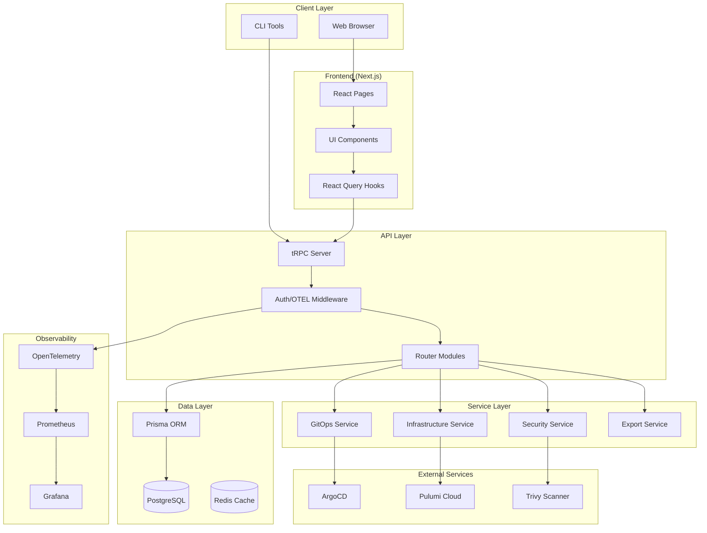
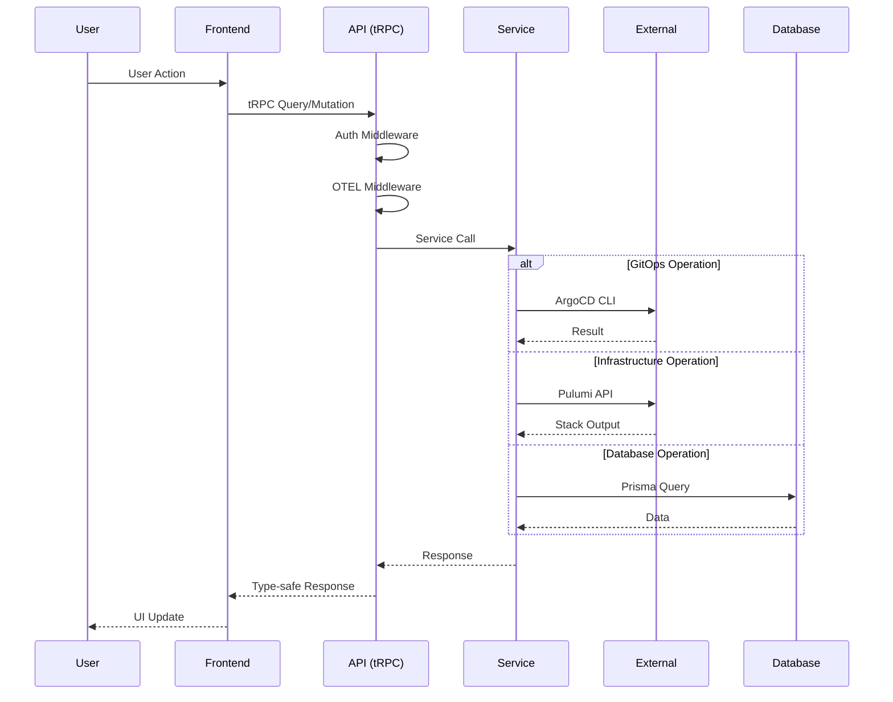
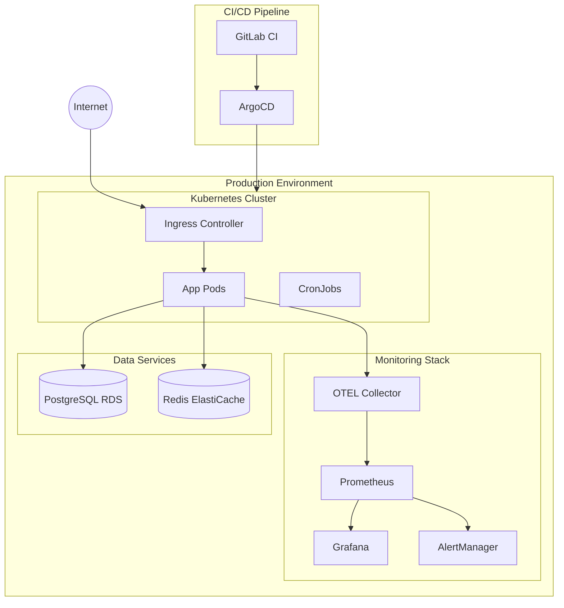
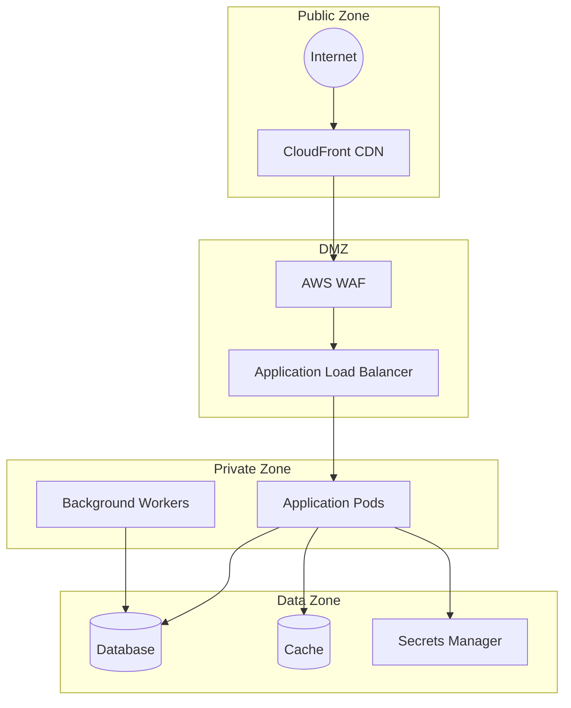

# System Architecture

## High-Level Architecture

## Component Descriptions

### Client Layer
- **Web Browser**: Primary user interface through Next.js application
- **CLI Tools**: Programmatic access via tRPC client

### Frontend Layer
- **React Pages**: Next.js pages with App Router
- **UI Components**: Shadcn/UI + Tailwind CSS components
- **React Query Hooks**: tRPC client hooks for data fetching

### API Layer
- **tRPC Server**: Type-safe RPC server
- **Router Modules**: Domain-specific routers (gitops, infrastructure, etc.)
- **Middleware**: Authentication (NextAuth) and OpenTelemetry tracing

### Service Layer
- **GitOps Service**: ArgoCD integration for Kubernetes deployments
- **Infrastructure Service**: Pulumi Automation API for IaC
- **Security Service**: Vulnerability scanning with Trivy
- **Export Service**: Helm/Kustomize/YAML generation

### External Services
- **ArgoCD**: GitOps continuous delivery
- **Pulumi Cloud**: Infrastructure state management
- **Trivy**: Container vulnerability scanning

### Data Layer
- **Prisma ORM**: Type-safe database access
- **PostgreSQL**: Primary data store
- **Redis**: Session and cache storage

### Observability
- **OpenTelemetry**: Distributed tracing
- **Prometheus**: Metrics collection
- **Grafana**: Visualization dashboards

---

## Data Flow Diagram

---

## Deployment Architecture

## Environment Configuration

| Environment | Cluster | Database | Cache |
|-------------|---------|----------|-------|
| Development | Local (Docker) | PostgreSQL (local) | Redis (local) |
| Staging | EKS staging | RDS PostgreSQL | ElastiCache |
| Production | EKS production | RDS PostgreSQL (Multi-AZ) | ElastiCache |

## Security Boundaries

## Technology Stack

| Layer | Technology |
|-------|------------|
| Frontend | Next.js 14, React 18, TypeScript |
| Styling | Tailwind CSS, Shadcn/UI |
| API | tRPC v11 |
| Database | PostgreSQL 15, Prisma ORM |
| Cache | Redis 7 |
| Auth | NextAuth.js v5 |
| Observability | OpenTelemetry, Prometheus, Grafana |
| GitOps | ArgoCD |
| IaC | Pulumi |
| Container | Docker, Kubernetes |
